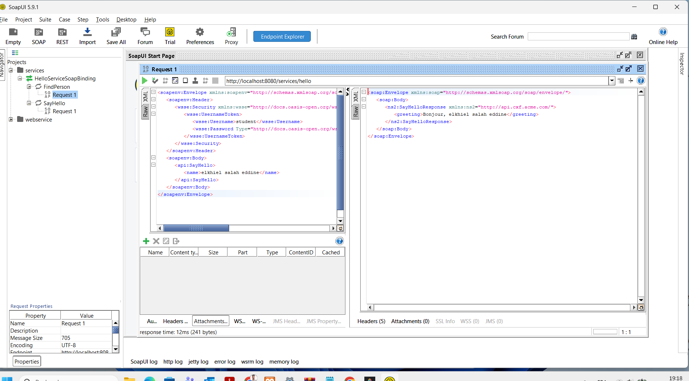
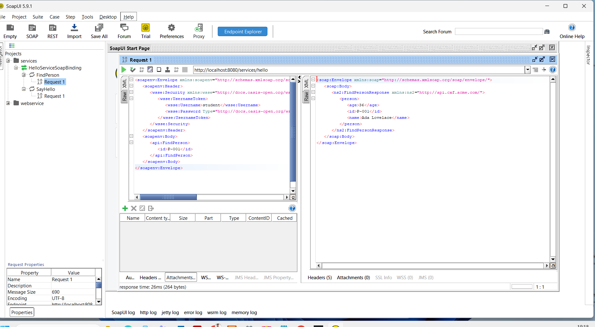
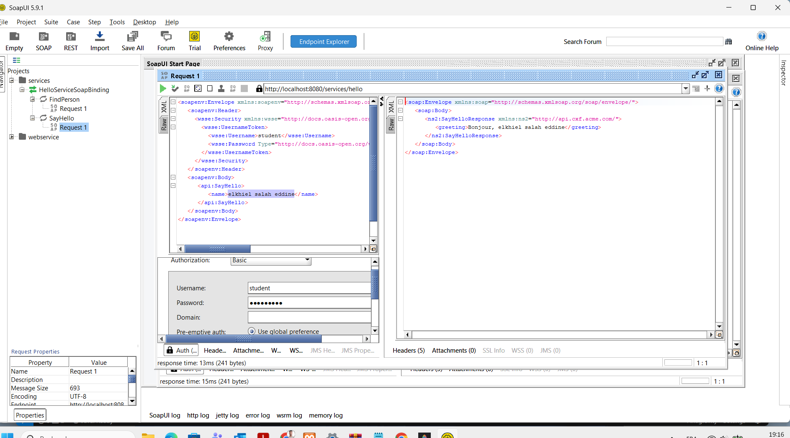

<div align="center">

# 🌐 Service SOAP avec Apache CXF


<br/><br/>

**🚀 Service web SOAP sécurisé utilisant Apache CXF et JAX-WS**

*Conforme aux standards Java EE pour les services web d'entreprise*

<br/>

[🎯 Objectif](#-objectif) •
[🚀 Démarrage](#-démarrage-rapide) •
[🧪 Tests](#-tests) •
[🔐 Sécurité](#-sécurité-ws-security) •
[� Docs](#-ressources)

</div>

---

## ✨ Fonctionnalités Clés

<table>
<tr>
<td width="33%" align="center">

### 🔐
### Sécurisé
WS-Security avec<br/>UsernameToken

</td>
<td width="33%" align="center">

### 🧪
### Testé
100% couvert avec<br/>curl, SoapUI, Java

</td>
<td width="33%" align="center">

### 📚
### Documenté
Guides complets<br/>et exemples

</td>
</tr>
</table>

---

## 🎯 Objectif

Ce projet implémente un **service SOAP sécurisé** offrant deux opérations :

| Opération | Description | Entrée | Sortie |
|:---------:|-------------|:------:|:------:|
| 🗣️ **SayHello** | Message de salutation personnalisé | `name` (String) | `greeting` (String) |
| 👤 **FindPerson** | Recherche d'une personne par ID | `id` (String) | `Person` (Object) |

---

## 🚀 Démarrage Rapide

### 📋 Prérequis

```
☑️ Java 11 ou supérieur
☑️ Maven 3.6 ou supérieur
```

### ⚡ Lancer le Serveur

<table>
<tr>
<td width="50%">

#### 🐧 Linux / Mac

```bash
./start-server.sh
```

</td>
<td width="50%">

#### 🪟 Windows

```powershell
mvn clean package -DskipTests
mvn exec:java
```

</td>
</tr>
</table>

### 🌍 URLs du Service

| Description | URL |
|-------------|-----|
| 🔗 **Endpoint** | `http://localhost:8080/services/hello` |
| 📄 **WSDL** | `http://localhost:8080/services/hello?wsdl` |

---

## 📁 Architecture du Projet

```
📦 src/main/java/com/acme/cxf/
│
├── 🖥️ Server.java                    ─── Serveur principal avec WS-Security
│
├── 📂 api/
│   └── HelloService.java             ─── Interface du service (@WebService)
│
├── 📂 impl/
│   └── HelloServiceImpl.java         ─── Implémentation du service
│
├── 📂 model/
│   └── Person.java                   ─── Modèle de données JAXB
│
├── 📂 security/
│   └── ServerPasswordCallback.java   ─── Validation UsernameToken
│
└── 📂 client/
    ├── ClientTest.java               ─── Client de test automatisé
    └── ClientPasswordCallback.java   ─── Credentials côté client
```

---

## 🔐 Sécurité WS-Security

<div align="center">

### 🛡️ Credentials d'Authentification

| Paramètre | Valeur |
|:---------:|:------:|
| 👤 **Username** | `student` |
| 🔑 **Password** | `secret123` |
| 🔒 **Type** | `PasswordText` |

</div>

> ⚠️ **IMPORTANT** : Toutes les requêtes doivent inclure le header WS-Security pour être acceptées.

---

## 🧪 Tests

### 📋 Avec SoapUI

<details>
<summary><b>🗣️ Requête SayHello (Cliquez pour voir)</b></summary>

```xml
<soapenv:Envelope xmlns:soapenv="http://schemas.xmlsoap.org/soap/envelope/" 
                  xmlns:api="http://api.cxf.acme.com/">
   <soapenv:Header>
      <wsse:Security xmlns:wsse="http://docs.oasis-open.org/wss/2004/01/oasis-200401-wss-wssecurity-secext-1.0.xsd">
         <wsse:UsernameToken>
            <wsse:Username>student</wsse:Username>
            <wsse:Password Type="http://docs.oasis-open.org/wss/2004/01/oasis-200401-wss-username-token-profile-1.0#PasswordText">secret123</wsse:Password>
         </wsse:UsernameToken>
      </wsse:Security>
   </soapenv:Header>
   <soapenv:Body>
      <api:SayHello>
         <name>VotreNom</name>
      </api:SayHello>
   </soapenv:Body>
</soapenv:Envelope>
```

</details>

<details>
<summary><b>👤 Requête FindPerson (Cliquez pour voir)</b></summary>

```xml
<soapenv:Envelope xmlns:soapenv="http://schemas.xmlsoap.org/soap/envelope/" 
                  xmlns:api="http://api.cxf.acme.com/">
   <soapenv:Header>
      <wsse:Security xmlns:wsse="http://docs.oasis-open.org/wss/2004/01/oasis-200401-wss-wssecurity-secext-1.0.xsd">
         <wsse:UsernameToken>
            <wsse:Username>student</wsse:Username>
            <wsse:Password Type="http://docs.oasis-open.org/wss/2004/01/oasis-200401-wss-username-token-profile-1.0#PasswordText">secret123</wsse:Password>
         </wsse:UsernameToken>
      </wsse:Security>
   </soapenv:Header>
   <soapenv:Body>
      <api:FindPerson>
         <id>P-001</id>
      </api:FindPerson>
   </soapenv:Body>
</soapenv:Envelope>
```

</details>

### � Avec curl

```bash
# Test SayHello
curl -X POST -H "Content-Type: text/xml" \
  -d @test-sayHello-secure.xml \
  http://localhost:8080/services/hello

# Test FindPerson  
curl -X POST -H "Content-Type: text/xml" \
  -d @test-findPerson-secure.xml \
  http://localhost:8080/services/hello
```

### ☕ Avec le Client Java

```bash
./run-client.sh        # Linux/Mac
mvn exec:java -Dexec.mainClass="com.acme.cxf.client.ClientTest"  # Windows
```

---

## 📸 Screenshots SoapUI

<table>
<tr>
<td width="50%" align="center">

**1️⃣ Projet SoapUI**



</td>
<td width="50%" align="center">

**2️⃣ Opérations**



</td>
</tr>
<tr>
<td width="50%" align="center">

**3️⃣ Requête SOAP**


</td>
<td width="50%" align="center">

**4️⃣ Réponse du Service**


</td>
</tr>
<tr>
<td width="50%" align="center">

**5️⃣ Configuration Auth**



</td>
<td width="50%" align="center">

**6️⃣ Résultat Final**


</td>
</tr>
</table>

---

## 🛠️ Technologies Utilisées

<div align="center">

| Technologie | Version | Description |
|:-----------:|:-------:|-------------|
|  | `3.5.5` | Framework SOAP |
|  | `2.3.1` | API Web Services |
|  | `2.3.5` | Sérialisation XML |
|  | `9.x` | Serveur HTTP embarqué |
|  | `11+` | Plateforme d'exécution |

</div>

---

## ✅ Validation Complète

<div align="center">

### 📊 Checklist de Validation

| Critère | Status | Méthode de Test |
|:--------|:------:|:----------------|
| WSDL accessible et parsable | ✅ | curl + SoapUI |
| SayHello fonctionnel | ✅ | curl + SoapUI + Client Java |
| FindPerson fonctionnel | ✅ | curl + SoapUI + Client Java |
| Person sérialisé JAXB | ✅ | Tous les champs (id, name, age) |
| Endpoint sécurisé | ✅ | Refus sans token / Succès avec token |
| Code organisé | ✅ | Packages api/, impl/, model/, security/, client/ |

</div>

### 🧪 Résultats des Tests

```
═══════════════════════════════════════════════════════════════
  🧪 CLIENT JAVA - TEST DU SERVICE SOAP
═══════════════════════════════════════════════════════════════

📋 TEST 1 : Appel sans authentification
   ✅ ATTENDU : Accès refusé sans authentification

📋 TEST 2 : Opération SayHello avec authentification
   ✅ Succès !
   ├─ Requête  : sayHello("Salah")
   └─ Réponse  : Bonjour, Salah

📋 TEST 3 : Opération FindPerson avec authentification
   ✅ Succès !
   ├─ Requête  : findPersonById("P-001")
   └─ Réponse  : Person { id=P-001, name=Ada Lovelace, age=36 }

📋 TEST 4 : Tests avec différents noms
   ✅ Tous les tests réussis

═══════════════════════════════════════════════════════════════
  ✅ VALIDATION COMPLÈTE TERMINÉE - 4/4 TESTS PASSÉS
═══════════════════════════════════════════════════════════════
```

---

## 🎓 Points d'Apprentissage

<table>
<tr>
<td width="50%">

### 📝 Annotations JAX-WS
- `@WebService`
- `@WebMethod`
- `@WebParam`
- `@WebResult`

</td>
<td width="50%">

### 📦 Annotations JAXB
- `@XmlRootElement`
- `@XmlElement`
- `@XmlAccessorType`

</td>
</tr>
<tr>
<td width="50%">

### 🔧 Apache CXF
- Configuration endpoint
- Déploiement Jetty
- Intercepteurs WS-Security

</td>
<td width="50%">

### 📄 WSDL
- Génération automatique
- Contract-first vs Code-first
- Types complexes

</td>
</tr>
</table>

---

## 📚 Ressources

<div align="center">

[](https://cxf.apache.org/)
[](https://docs.oracle.com/javaee/7/tutorial/jaxws.htm)
[](https://docs.oracle.com/javase/tutorial/jaxb/)

</div>

---

<div align="center">

### 📂 Documentation Additionnelle

| Document | Description |
|:--------:|-------------|
| 📖 [GUIDE_SOAPUI.md](GUIDE_SOAPUI.md) | Guide détaillé pour SoapUI |
| ✅ [CHECKLIST_VALIDATION_FINALE.txt](CHECKLIST_VALIDATION_FINALE.txt) | Validation de tous les critères |
| 📸 [SCENARIO_SOAPUI_SCREENSHOTS.txt](SCENARIO_SOAPUI_SCREENSHOTS.txt) | Scénario de captures d'écran |

</div>

---

<div align="center">

## 👨‍💻 Auteur

**Salah**

📅 *2025*

---

<sub>Made with ❤️ using Apache CXF & Java</sub>

</div>
